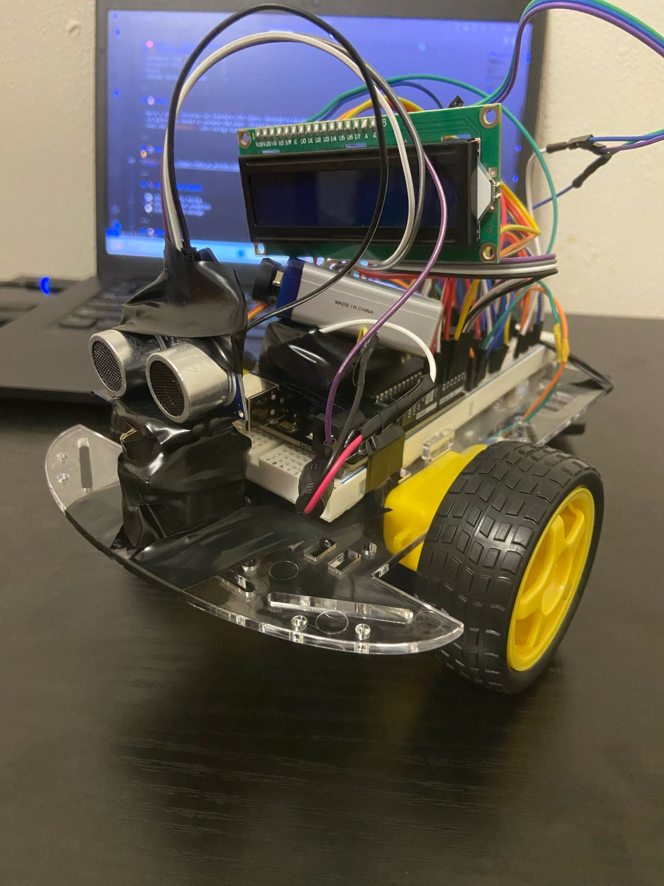

# 🧠 Robie Jr. – Polished Version (Week 5)

This version of Robie Jr. includes **fully refactored code**, **LCD feedback**, a **buzzer**, **LED eye**, and **improved logic**.

---

## ✅ Features

- 🚀 Clean & modular Arduino code
- 🧠 Smart turning with servo scan (left/right comparison)
- 🧱 Obstacle avoidance
- 🗨️ LCD screen displays current action (no flickering)
- 👁️ LED eye lights up when moving forward
- 📢 Buzzer beeps based on proximity
- 🔋 Dual 9V battery support for motor + logic
- ⚡ LCD glitch fixed (no random characters)

---

## 🚦 Wiring (Arduino Uno)

| Component        | Pin(s)        |
|------------------|---------------|
| Motor A (L293D)  | 9, 8, ENA: 6  |
| Motor B (L293D)  | 4, 3, ENB: 5  |
| Servo            | D7            |
| Ultrasonic Trig  | D12           |
| Ultrasonic Echo  | D11           |
| Buzzer           | D2            |
| LCD1602 (Parallel) | A0–A5       |
| Eye LED          | D13           |

---

## 📝 Notes

- Buzzer and servo conflict resolved by changing PWM pin usage
- LCD bug fixed by switching to battery power (USB caused flickering)
- LCD only updates when text changes (avoids flashing)
- Turning logic now properly rotates 90 degrees toward safe path

---

## 📸 Preview

  

---

## 🔧 Future Additions

- 🎭 Idle servo scan animation
- 💬 Personalized voice or greeting system
- 🧠 Add IR sensors (Week 6)
- 🎮 Remote control mode

---

## 🚀 How to Run

1. Open `robie_jr-polished.ino` in Arduino IDE
2. Upload to Arduino Uno
3. Power Arduino with 9V battery
4. Power motor circuit separately with second 9V battery
5. Watch Robie Jr. come to life! 🤖
