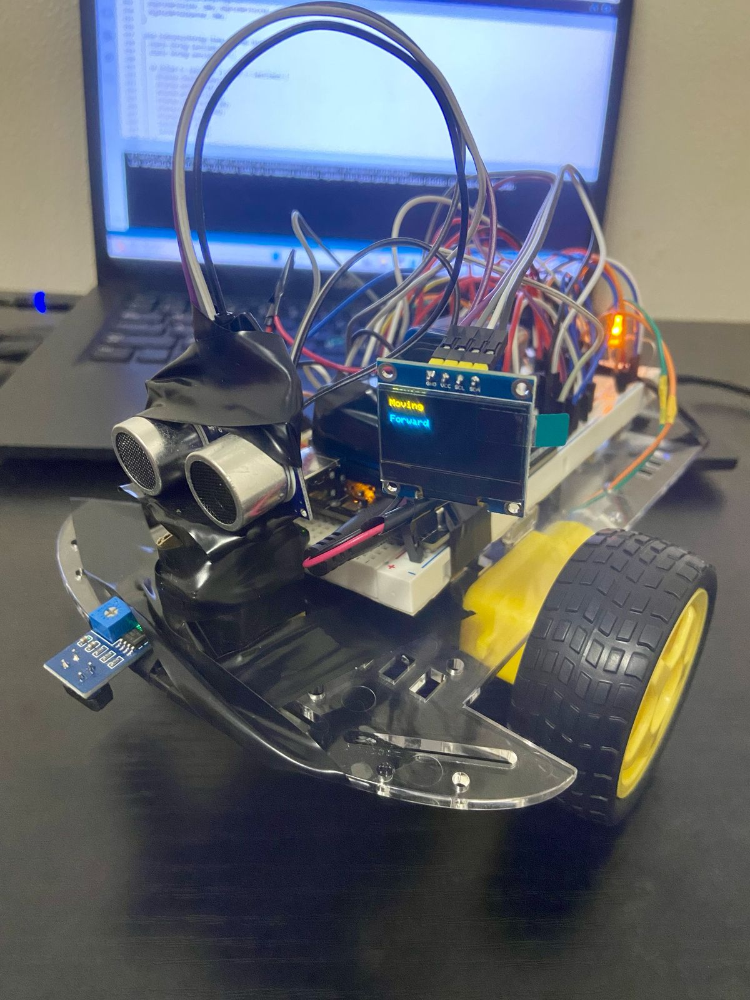

# ✨ Robie Jr. – OLED + IR Edition (Week 6)

This version of Robie Jr. features an upgrade from the classic LCD to a sleek **OLED display**, along with the integration of an **IR obstacle sensor** for improved detection.

---

## ⚙️ Key Features

- 🖥️ **0.96" OLED Display (SSD1306 I2C)** – Replaces the 1602 LCD
- 🧠 **Smart Obstacle Avoidance** – Combines ultrasonic and IR sensors
- 📢 **Buzzer Feedback** – Beeps based on proximity
- 👁️ **LED Eye Indicator** – Lights up when moving forward
- 🔄 **Servo-Based Scanning** – Decides turn direction dynamically
- 🧽 **Polished Code** – Refactored with detailed comments and modularity

---

## 🧰 Components Used

- Arduino Uno
- 2x DC Motors + L293D Motor Driver
- HC-SR04 Ultrasonic Sensor
- TCRT5000 IR Sensor (1-channel)
- SG90 Servo Motor
- 0.96" I2C OLED Display (128x64, SSD1306)
- Passive Buzzer
- LED (pin 13)
- Dual 9V Battery Setup (motors + logic)

---

## 📷 Robie Jr. in Action

  

---

## 🔌 Wiring Notes

- **OLED** uses I2C:  
  SDA → A4  
  SCL → A5  

- **IR Sensor** connected to pin **10**

- **Buzzer** remains on pin **2**

- **LCD library removed** and replaced with Adafruit SSD1306 + GFX libraries

---

## 📝 Summary

Robie Jr. now reacts faster and displays clear feedback using an OLED. This update improves power handling, user feedback, and prepares the bot for more advanced sensors in the next stages.

---

> ✅ Save and commit this file to: `week_6/RobieJr_oled/README.md`
